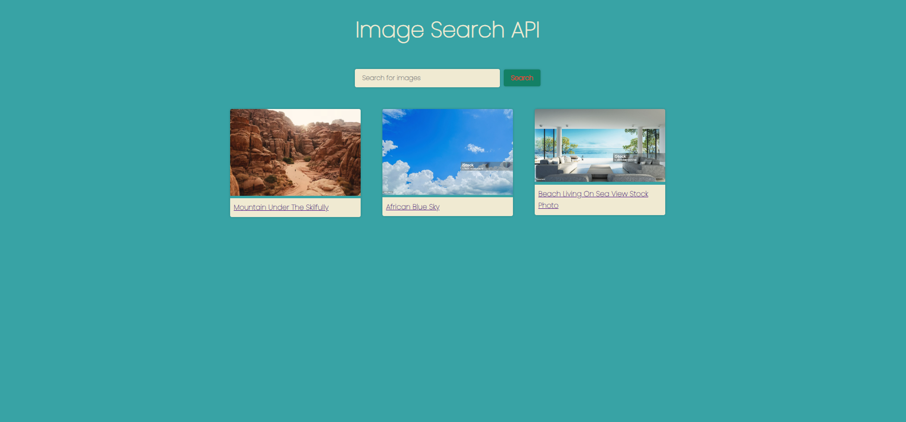
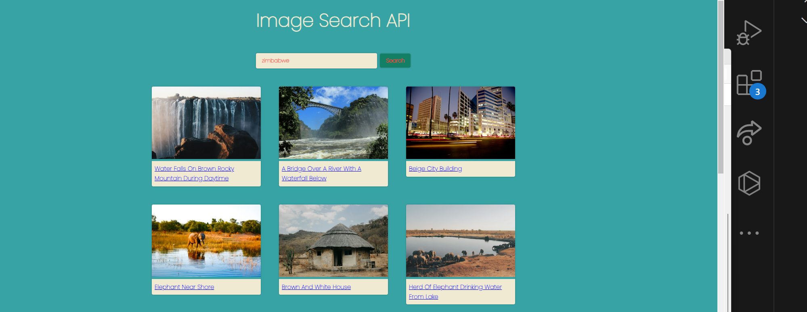
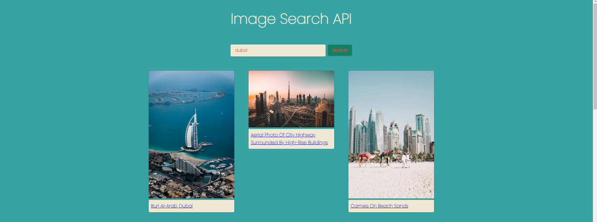
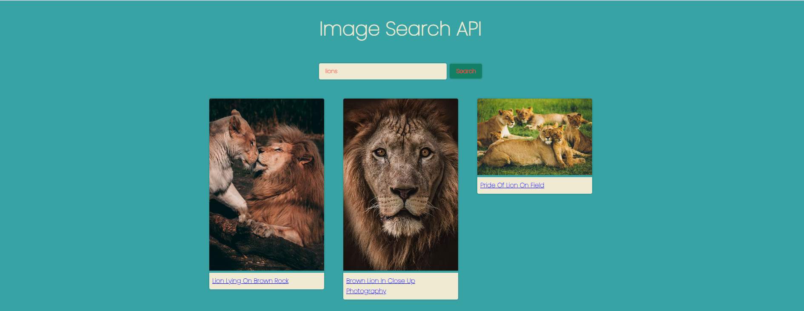
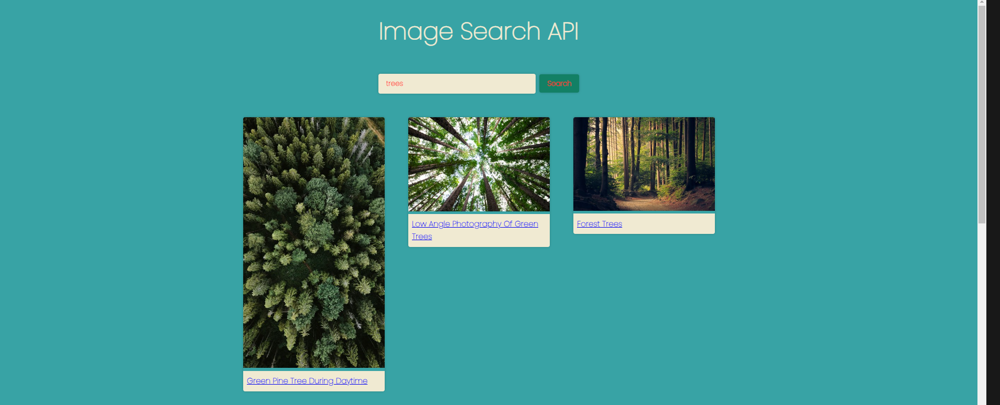
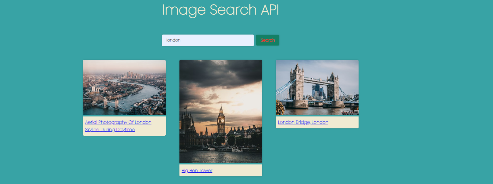
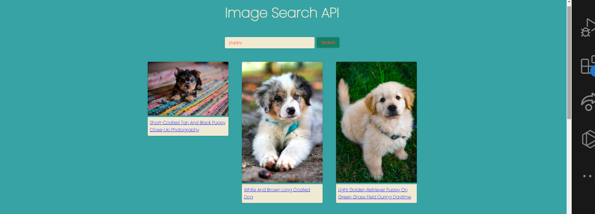
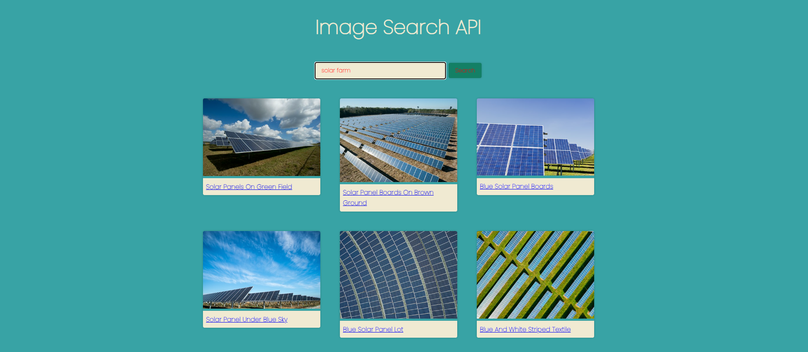

# Search Photo API
## Description 
In this web application, I aimed to create a search engine where, users can type a word or words to search for an image. The photo that the user searched is then uploaded to the web page. I have used an API from unsplash.com to enable the search functionality. 

By default, the app shows three images. However, when a user for example types "dog", the images of dogs is populated on the screen. The user can then do whatever they want with the photos. 

I have used HTML, CSS, JavaScript and Unsplash API. I have also heavily commented the code so that any new beginners or even experienced programmers can understand the code.

I worked on this application to understand API and JavaScript better.

## Table of Contents (Optional)
N/A

## Installation

The web application does not require any installation and will run on most internet browsers. The web application is deployed at this link here and feel free to click and experience its magical works:https://mikemupararano.github.io/search-photo-api/ . The Github repository is on this link:https://github.com/Mikemupararano/search-photo-api.

## Usage 
To have an idea of what is in this web application, please click on this link: https://mikemupararano.github.io/search-photo-api/. The Github repository is on this link:https://github.com/Mikemupararano/search-photo-api .

## Credits
I researched website and watched several videos to adapt and work out the code in this web application. I used the following web-links for research and support:
(1) https://medium.com/@fyattani/20-simple-javascript-and-api-projects-for-practice-and-learning-e98925ec4e1d
(2) https://www.youtube.com/watch?v=oaliV2Dp7WQ
(3) https://www.istockphoto.com/photo/blue-sky-gm515145609-47832164?phrase=free+images
(4) https://www.youtube.com/watch?v=_RfVj2CHHqc

## License

See the repository for any information on the MIT license.
🏆 

## Badges
N/A
## Features

N/A
## Contributing

Any other contributors are welcome to contact me and add to my code or suggest improvements. Click on this link to contribute on improvements: https://github.com/Mikemupararano/search-photo-api.

## Tests
N/A
© 2023 edX Boot Camps LLC. Confidential and Proprietary. All Rights Reserved.

